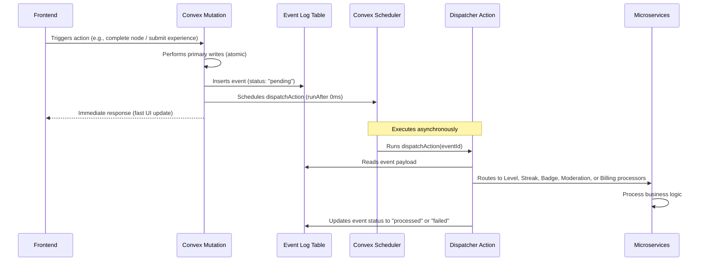
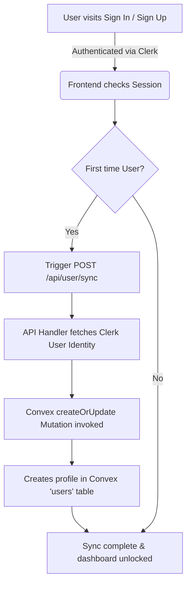
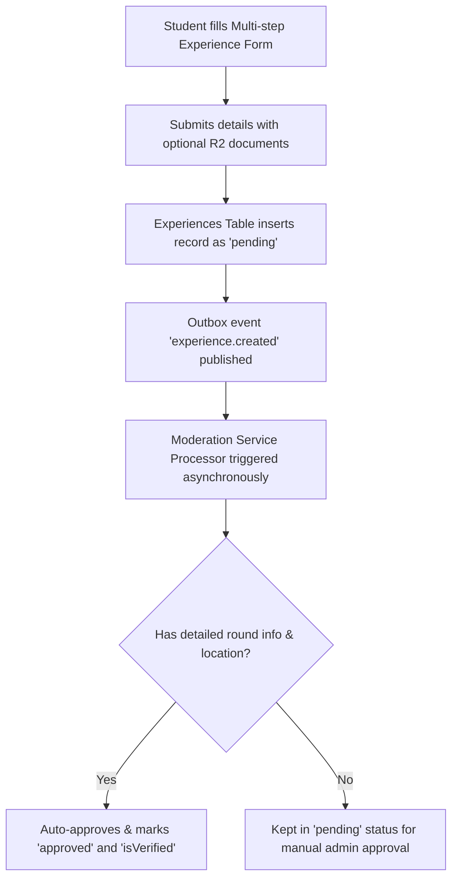
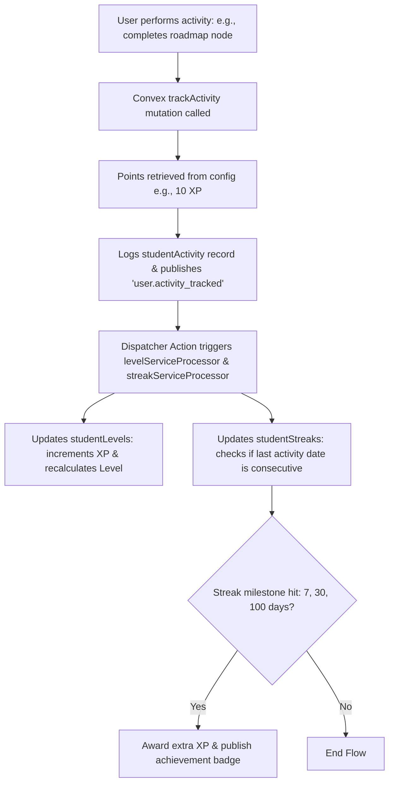

# PSG Placement Hub — Comprehensive Project Documentation

Welcome to the official developer and architecture documentation for the **PSG Placement Hub**. This portal provides real-time interview experiences, interactive roadmaps, career audit services, and structured preparation resources for PSG College students.

---

## 1. Executive Summary & Core Purpose

The PSG Placement Hub is a modern, high-performance web platform designed to bridge the gap between academic preparation and industry placement expectations. By crowdsourcing verified interview experiences from senior students and providing interactive DSA and role-based roadmaps, the platform acts as a centralized prep guide. 

The application utilizes a **freemium SaaS model** where foundational content is open to all students, and advanced roadmap details, interview round breakdowns, and career services (resume/portfolio reviews) are unlocked via a subscription gateway.

---

## 2. Technology Stack

The platform is built on a serverless, real-time, event-driven architecture using modern engineering practices:

| Layer | Technology | Purpose |
| :--- | :--- | :--- |
| **Frontend & SSR** | **Next.js 16 (React 19 & TypeScript)** | Core framework, routing, and server actions/API endpoints. |
| **Styling** | **Tailwind CSS v4** | Utility-first styling with modern performance. |
| **Animations** | **GSAP, Framer Motion, Anime.js** | Rich, fluid micro-interactions and visual loops. |
| **Realtime Database**| **Convex** | Real-time database, background execution, and queries/mutations. |
| **Authentication** | **Clerk + Custom JWT hybrid (`jose` + `bcryptjs`)** | Clerk for SaaS identity; custom JWT for fallback auth. |
| **Caching & Rate Limiting**| **Upstash Redis** | Caching premium checks and rate-limiting sensitive routes. |
| **Payments** | **Razorpay SDK** | Payment orchestration and processing. |
| **File Storage** | **Cloudflare R2 (via AWS S3 SDK)** | Document uploads (resumes/resources) with presigned URLs. |
| **Emails** | **Resend** | Automated transactional and alert emails. |

---

## 3. Directory Structure

```
├── app/                        # Next.js pages and Route Handlers
│   ├── (auth)/                 # Clerk-protected routes (dashboard, saved, submit)
│   ├── (premium)/              # Paywalled premium routes (resources)
│   ├── (public)/               # Publicly accessible routes (browse, experience, privacy, terms)
│   ├── api/                    # Serverless API routes
│   │   ├── admin/              # Administrative functions
│   │   ├── auth/               # Custom JWT login/signup routes
│   │   ├── payment/            # Razorpay order generation & signature verification
│   │   │   ├── create-order/   # Order creator (tamper-proof catalog pricing)
│   │   │   └── verify/         # Cryptographic payment verifier
│   │   ├── seed/               # DB seed scripts
│   │   ├── upload/             # Cloudflare R2 file uploader
│   │   ├── user/               # Clerk user synchronization
│   │   └── webhook/            # Razorpay payment verification webhooks
│   └── roadmap/                # Learning roadmaps and company guides
│
├── components/                 # Shared React Components
│   ├── ui/                     # Shadcn UI primitives
│   ├── roadmap/                # Interactive roadmap trees & nodes
│   │   ├── company-guide.tsx   # Company timeline guides (Google, Microsoft, etc.)
│   │   ├── dsa-roadmap.tsx     # Tree component for DSA concepts
│   │   └── role-skill-tree.tsx # Clickable skill trees for SWE, DevOps, etc.
│   ├── experience-card.tsx     # Experience summary layout
│   └── premium-gate.tsx        # Subscription blocking overlay UI
│
├── convex/                     # Convex Backend Functions
│   ├── _generated/             # Automatically generated types and API client
│   ├── admin.ts                # Administrative operations
│   ├── bookings.ts             # Career service bookings (resume, portfolio reviews)
│   ├── events.ts               # Event Outbox processor (event-driven microservices)
│   ├── experiences.ts          # Interview experience CRUD operations & filters
│   ├── files.ts                # Metadata storage for uploaded files
│   ├── http.ts                 # HTTP webhook handlers (e.g. Razorpay payment capture)
│   ├── orders.ts               # Order registration and premium entitlement logic
│   ├── schema.ts               # Strict relational schema definition
│   ├── tracking.ts             # Gamification systems (XP, streaks, goals, badges)
│   └── users.ts                # User profiles and authentication helpers
│
└── lib/                        # Utility Libraries
    ├── auth.ts                 # Zod validation schemas & custom JWT utilities
    ├── r2.ts                   # S3 client helper for Cloudflare R2 integration
    ├── redis.ts                # Upstash Redis connection client, caching, and rate limiters
    └── utils.ts                # Tailwind utility merges (cn classnames helper)
```

---

## 4. Database Schema (Convex)

Convex defines a structured database schema with indexes and search indexes in `convex/schema.ts`:

1. **`users`**: User records, including Clerk IDs, email, custom profiles, roles (`student`, `contributor`, `admin`), premium membership expiration (`premiumUntil`), and badges array. Indexed by Clerk ID and email.
2. **`experiences`**: Crowdsourced interview experiences. Details include company name, role title, difficulty level (`easy`, `medium`, `hard`), opportunity type (`internship`, `fulltime`), upvotes, compensation, and round-by-round descriptions. Searchable via a dedicated search index on company name and filters.
3. **`documents`**: Tracks file uploads inside Cloudflare R2, including filename, size, mime type, public status, key, and bucket.
4. **`resources`**: Preparation templates, guides, checklists, or company packs. Refers to `documents` for file downloads.
5. **`savedExperiences`** & **`votes`**: Junction tables mapping user-to-experience interactions for saved bookmarks and upvotes.
6. **`orders`**: Record of product purchases (`premium_3months`, `resume_vault`, etc.), capturing Razorpay order IDs, payment IDs, and completion statuses (`created`, `paid`, `failed`).
7. **`serviceBookings`**: Tracks premium audit bookings (`resume_review`, `github_audit`, `portfolio_audit`) and progress statuses (`pending`, `in_review`, `completed`).
8. **`roadmaps`** & **`userProgress`**: Learning paths and progress logs mapping nodes completed by individual students.
9. **`studentActivity`**: Event logs of student actions (e.g., node completed, experience upvoted, goal met) representing XP contributions.
10. **`studentStreaks`**, **`studentLevels`**, & **`studentAchievements`**: Gamification states (streaks, current level, XP, badges earned).
11. **`events`**: **Event Outbox Queue** for decoupled async processing of internal actions.

---

## 5. System Design & Architectural Patterns

### A. The Event-Driven Outbox Pattern
To prevent slow background logic (like streak updates, XP calculation, content moderation, or billing modifications) from blocking user mutations, the platform implements an event outbox pattern:



### B. Freemium & Paywall Access Model
* **Free Content**: The top 5 upvoted interview experiences are auto-configured as "Free Previews" via the `fixFreemium` mutation.
* **Paywalled Content**: Detailed round structures, questions, resources, and narrative text on other experiences are paywalled. 
* **Data Striping**: When a non-premium user requests a premium experience, the server-side Convex query `getById` strips out sensitive keys (e.g., `roundsJson`, `tips`, `questionsAsked`) before sending the JSON response. This prevents client-side bypasses of the paywall.

### C. Double-Layer Security Verification
To prevent clients from tampering with purchase amounts or spoofing successful payments, checkout implements a secure, verified loop:
1. **Server-Side Pricing**: Prices are maintained in a secure dictionary (`PRODUCTS`) in Next.js Route Handlers. The client only sends the product key (e.g. `premium_3months`), preventing parameter tampering.
2. **Cryptographic Verification**: Webhooks and callbacks check the Razorpay signature via an HMAC-SHA256 hash using the shared secret.
3. **Cross-Check API Calls**: The server performs a direct server-to-server fetch of the order status (`razorpay.orders.fetch(orderId)`) directly from the Razorpay API to verify the amount paid matches our product catalog before granting premium access.

---

## 6. Core Application Flows

### 1. User Authentication & Profile Synchronization Flow


### 2. Interview Experience Submission & Moderation Flow


### 3. Gamification & XP System Flow


---

## 7. Security Architecture

1. **Strict Content Security Policy (CSP)**:
   The Next.js Middleware injects strict CSP headers blocking unauthorized inline scripts and tracking origins. It explicitly limits script, connection, and frame origins to Clerk authentication and Razorpay checkout script locations (`https://checkout.razorpay.com`).
2. **Redis-Backed API Rate Limiter**:
   API endpoints for payment initiation, user syncing, and webhooks are monitored via an Upstash Redis sliding window. It allows a maximum of 15 requests per minute for payment creation, returning HTTP 429 status code for spam requests.
3. **Hardware & Origin Protections**:
   - `X-Frame-Options: DENY`: Blocks Clickjacking inside frames.
   - `X-Content-Type-Options: nosniff`: Mitigates MIME sniffing exploits.
   - Permissions Policy blocks camera, geolocation, and microphone access.

---

## 8. Deployment & Environmental Settings

To run the application, the following environment variables must be configured:

```env
# Convex Deployment Credentials
CONVEX_DEPLOYMENT=
NEXT_PUBLIC_CONVEX_URL=

# Clerk SaaS Authentication Keys
NEXT_PUBLIC_CLERK_PUBLISHABLE_KEY=
CLERK_SECRET_KEY=

# Upstash Redis Cache & Rate Limiter Configuration
UPSTASH_REDIS_REST_URL=
UPSTASH_REDIS_REST_TOKEN=

# Razorpay Payment Gateway Credentials
RAZORPAY_KEY_ID=
RAZORPAY_KEY_SECRET=
RAZORPAY_WEBHOOK_SECRET=

# Cloudflare R2 Storage Configurations (S3 Protocol Compatible)
CLOUDFLARE_ACCOUNT_ID=
R2_ACCESS_KEY_ID=
R2_SECRET_ACCESS_KEY=
R2_BUCKET_NAME=
R2_PUBLIC_URL=

# Resend Email Configuration
RESEND_API_KEY=

# Custom Auth Encryption Key (Fallback)
NEXTAUTH_SECRET=
```
